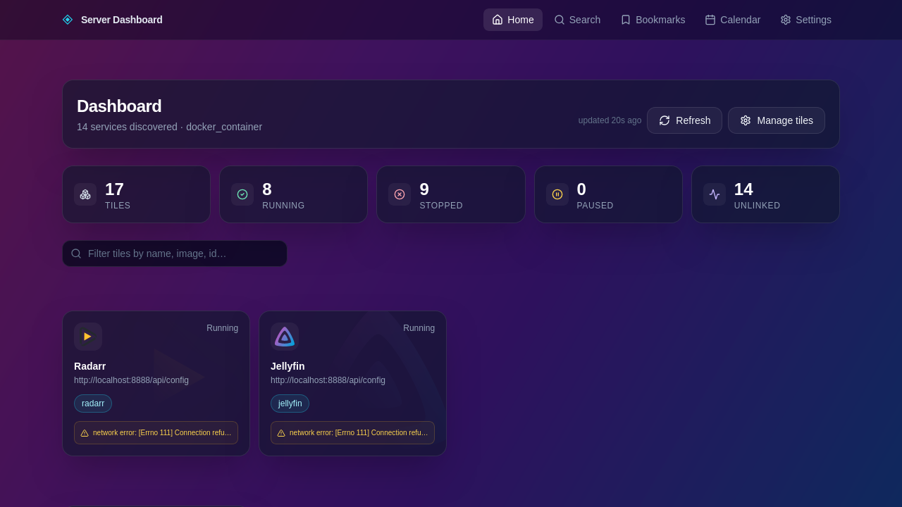
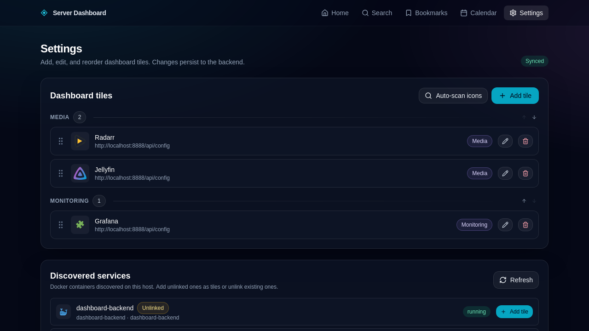
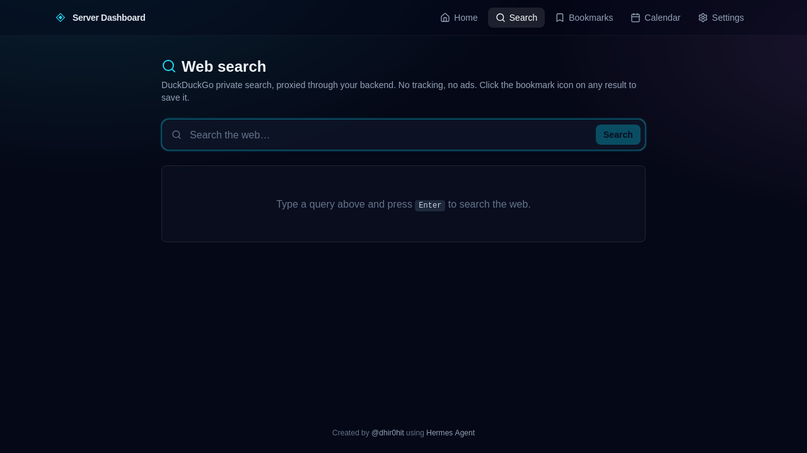
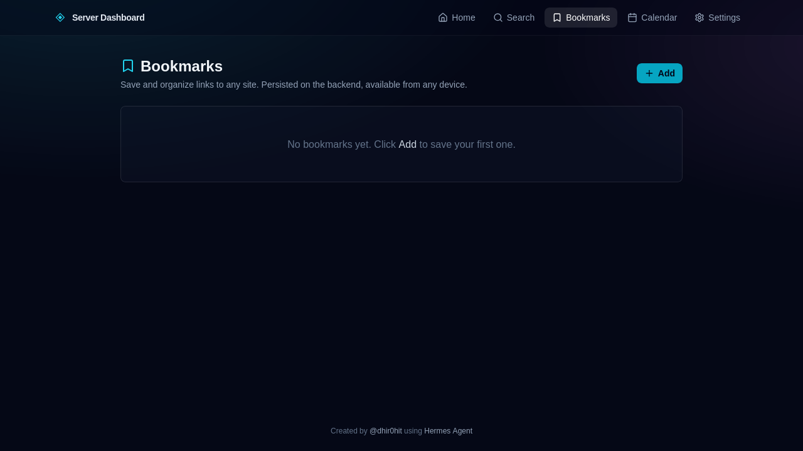
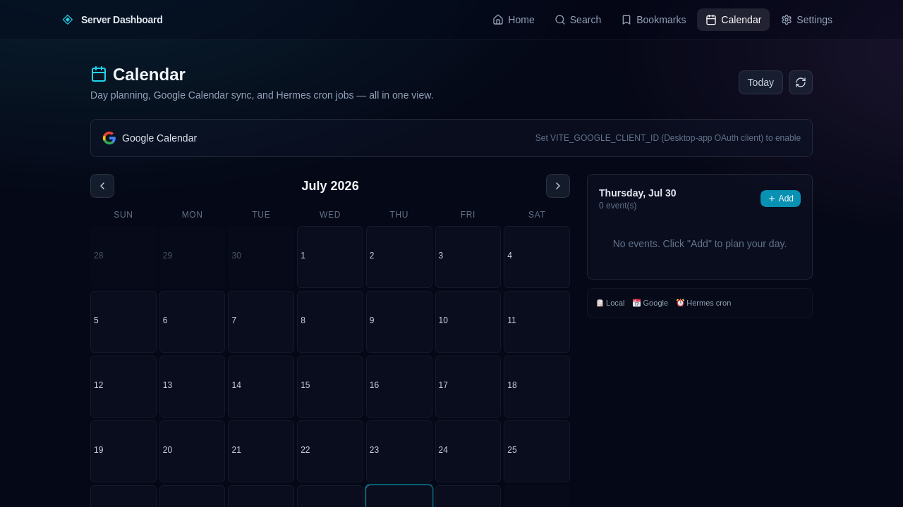

# Server Dashboard

[](https://opensource.org/licenses/MIT)

A full-stack dashboard for services running in Docker. The backend (FastAPI)
discovers containers via the local Docker socket and exposes their status,
ports, and labels. The frontend (React + Vite + Tailwind) renders the discovered
services as animated tiles with health polling, a settings page for managing
dashboard layout, and per-service background effects.

## Screenshots

### Dashboard — Tile Grid


### Settings — Tile Management, Background & Theme


### Search — Private Web Search


### Bookmarks


### Calendar


## Architecture

```
┌─────────────────────────────────────────────────────────────────────┐
│  docker compose up                                                  │
│                                                                     │
│  ┌───────────────────────┐         ┌──────────────────────────────┐ │
│  │  frontend (nginx:80)  │  :8888  │  backend (FastAPI :8000)     │ │
│  │  ─ React SPA          │ ◀────── │  ─ Docker socket discovery    │ │
│  │  ─ nginx serves dist/  │ proxies │  ─ SQLite config persistence  │ │
│  │  ─ /api proxy to      │  /api/  │  ─ Wallpaper upload/storage    │ │
│  │    backend            │   /wppr │                                │ │
│  └───────────────────────┘         └──────────────────────────────┘ │
│         │                                       │                  │
│         │ exposed                                mounts             │
│         ▼                                       ▼                  │
│     :8888 (host)                  dashboard-config, dashboard-wppr  │
└─────────────────────────────────────────────────────────────────────┘
```

Only the frontend service is published to the host (port 8888 by default). It
reverse-proxies `/api/*` and `/wallpapers/*` to the backend, so the user
talks to exactly one origin and no CORS configuration is needed in production.

## Quick start (mock mode)

`docker compose up` defaults to `MOCK=true`, so the stack boots without a real
Docker socket. The dashboard starts empty — add your own tiles via Settings:

```bash
git clone <this repo> && cd Dashboard
docker compose up --build
```

Open http://localhost:8888 — you will see a clean tile grid (no pre-populated
services), search/filter controls, and the Settings page. Add tiles for your
services in Settings → Dashboard tiles → Add tile. Set `MOCK=false` to talk to
a real Docker socket.

## Configuring for real Docker discovery

1. Copy the env template and edit it:
   ```bash
   cp .env.example .env
   $EDITOR .env
   ```
2. Set, at minimum:
   - `DOCKER_SOCK=/var/run/docker.sock` — the host Docker socket path. The
     compose file already mounts this into the backend container.
   - `MOCK=false` to stop returning mock data and discover real containers.
3. Google Calendar setup (one-time):
   - Create a **Desktop app** OAuth client in [Google Cloud Console](https://console.cloud.google.com/apis/credentials)
     - Enable the **Google Calendar API**
   - Add `VITE_GOOGLE_CLIENT_ID=<your-desktop-client-id>.apps.googleusercontent.com` to your `frontend/.env`
4. Bring the stack up:
   ```bash
   docker compose --env-file .env up --build
   ```

See `backend/.env.example` for the full list of environment variables.

## Volumes & persistence

The compose file declares two named volumes:

| Volume                  | Mount (in backend) | Purpose                               |
|-------------------------|--------------------|---------------------------------------|
| `dashboard-config`     | `/data`            | SQLite database backing `/api/config` |
| `dashboard-wallpapers` | `/app/wallpapers`  | Uploaded wallpaper images             |

Both survive container restarts and `docker compose down` (but are removed by
`docker compose down -v`).

## Single-port access

The frontend nginx config proxies all backend traffic:

| Route                  | Served by                |
|------------------------|--------------------------|
| `/`                    | React SPA (`index.html`) |
| `/assets/*`            | Vite-built static assets |
| `/api/*`               | `backend:8000`           |
| `/wallpapers/*`        | `backend:8000`           |

Change the published host port with `DASHBOARD_PORT` (default `8888`).

## Files

```
.
├── docker-compose.yml     # service definitions, env vars, volumes
├── .env.example           # copy to .env for real-Docker configuration
├── README.md              # this file
├── backend/
│   ├── Dockerfile         # FastAPI + uvicorn runtime
│   ├── .dockerignore
│   ├── requirements.txt
│   ├── .env.example       # backend-specific vars (used in local dev)
│   └── app/               # FastAPI application code
└── frontend/
    ├── Dockerfile         # multi-stage: vite build + nginx runtime
    ├── .dockerignore
    ├── nginx.conf         # SPA serve + /api proxy
    ├── package.json
    ├── vite.config.ts
    └── src/               # React + Tailwind SPA
```

## Local development (without Docker)

```bash
# Backend
cd backend
python -m venv .venv && . .venv/bin/activate
pip install -r requirements.txt
MOCK=true uvicorn app.main:app --reload --port 8000

# Frontend (in another shell)
cd frontend
npm install
npm run dev   # http://localhost:5173 — vite dev-proxies /api → :8000
```

## Troubleshooting

- **No services discovered**: check the backend logs
  (`docker compose logs backend`). Mock mode returns an empty service list; real
  mode returns only containers visible to the mounted Docker socket. Confirm
  the socket is mounted (`DOCKER_SOCK` in `.env` and the volume in
  `docker-compose.yml`).
- **`port 8888 is already in use`**: set `DASHBOARD_PORT=8000` (or any free
  port) in your `.env` and restart.

## Verification checklist (acceptance)

- [x] `docker compose up --build` builds and starts both containers
- [x] Dashboard is reachable at http://localhost:8888 (single published port)
- [x] `/api/services` proxies through to the backend and returns mock services
- [x] Config edits persist across `docker compose down` / `up` ( SQLite
      volume)
- [x] Docker socket is configurable via the `DOCKER_SOCK` environment variable
